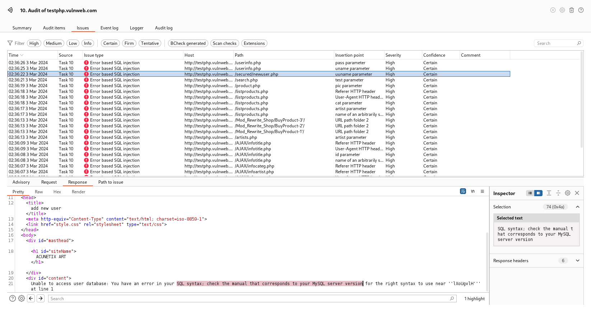

## [error-based-sql-injection.bcheck](/error-based-sql-injection.bcheck)
### Bcheck Script/Template to Detect SQL Injection Based on Error
This script automatically appends a payload each time to an insertion points from a proxy request, checking the response for SQL errors.
All the regex errors were copied from [sqlmap](https://github.com/sqlmapproject/sqlmap), and it's detected database type as sqlmap do.
- You can add your own payload to the list.
- You can replace the world "appending" by "replacing" and that will empty the insertion points and put only the payload.

Please note this is an "active scan", which means it'll make an additional request from the original request. Use it with caution.
```java
# You can append your payloads to the list.
run for each:
    sqli_payload =
        "'",
        "\"",
		";" #one more
		
		
# You can change from appending to an insertion point or replacing it with a payload. Please uncomment the chosen method and confirm the other one by placing a hash sign at the beginning of the line. #
send payload:
	appending: {sqli_payload}
	#replacing: {sqli_payload}
			
```



> *"insertion points": query parameters, post data, path, header*
